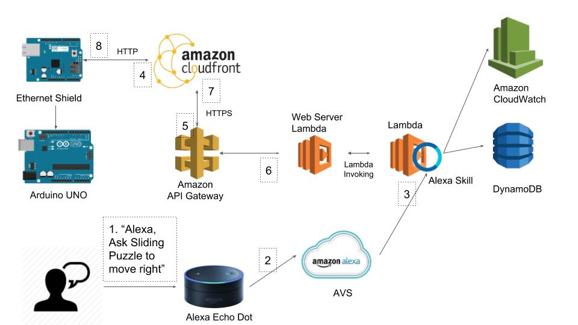

# Step 0: System Architecture

## Interaction Flow
Nothing speaks clearer than a solid example, in the following step-wise description of the interaction flow, a player wants to update the state of a sliding puzzle, whose logic is executed in *Lambda Function* and whose puzzle status is stored in *DynamoDB*, and have Arduino notified.

1. The user begins by invoking *Your_Alexa_Skill_Invocation_Name*, followed by a matching *utterance* that specify an *intent*. For example, "Ask Sliding Puzzle to move right": where ``"Sliding Puzzle"`` is its invocation name, and `"move {direction}"` matches an utterance.
2. The Alexa Echo (Dot, Swift etc.) will pass on the recorded audio to *Amazon Voice Service (AVS)* for speech to text processing. After the vocal command is interpreted, AVS will find the specific Alexa Skill the input is targeting based on the invocation name, thus formatting the structure-less sentence into a standard JSON object and feed to your Alexa skill which is residing on *Amazon Lambda Function*
3. After executing the respective logic for the intent in the incoming input (in our case: `MoveIntent` with parameter `Right`), updating the persistent states for variables in *DynamoDB*.
4. *Arduino UNO* could now query the puzzle state, or rather the next move in the pipeline via a HTTP request sent by Ethernet Shield stacked on top of it. Instead of sending request directly to *Amazon API Gateway*, which acts as a gate keeper handling incoming http request and certain Lambda Function, **we use *Amazon CloudFront* as a proxy server/bridge, due to the fact that *Amazon API Gateway* only accepts HTTPS request while Arduino could only send HTTP request**. [related Stackoverflow](https://stackoverflow.com/questions/43236152/how-to-make-aws-api-gateway-accept-http-instead-of-https/49992626#49992626)
5. Upon receiving request, *CloudFront* will encapsulate the packet into a SSL-enable HTTPS packet and forward it to *API Gateway*
6. Consequentially, the request will be embedded in a Lambda Function call and the querying parameters (e.g. `xxxx.cloudfront.net/puzzle?action=move&direction=left`) will be transformed and stored under `event` parameter in Lambda's handler function. ( Don't worry if these variables make no sense now, [details are shown later](./4-webserver-lambda-function.md) )
7. The last step is optional, but this our design, **we modulate/separate the web server out as an individual lambda function**. Needless to say, you could include those as functions in your original Alexa Skill, but personally I prefer better modularity and separation of concern for easier debugging and future extension. But meantime, it means further **inter-invoking of the two Lambda Functions (Alexa Skill & Web Server) are required**.[details about invoking another Lambda functions](./2-invoking-lambda-function.md)

## Push v.s. Pull
Like mentioned [before](./README.md#before-going-further-you-should-know), the main reason for setting up a second Lambda Function as a Web Server is the dynamic address or private network address being assigned to Arduino's Ethernet Shield behind an institutional network/firewall.

In anthoer word, any outgoing network requests are fine since the institution router or the proxy server will implement their port forwarding/translation, but the IP address known to Arduino is not globally addressable, thus not reachable by any host outside your institutional network, which includes Amazon's server ( in our case sitting in N.Virginia, while my Arduino connects to the university network in Singapore).

The workaround is what I call **Pull over Push** paradigm, where the Arduino periodically **pull** the status, or update the web server, compared to the optimal case where Amazon Lambda Function could directly **push** the new updated puzzle states to my Arduino.

Next question is: *is it feasible from economic/cost perspective* ? Here is the simple math:
>1 month = 2.62 million sec

>Lambda Function free tier = 1 million requests/month

> => as long as you are not running 24/7, pulling every other second should totally works for most Arduino application. Most Arduino side will take more than 2 seconds to complete its job until the next pull.
