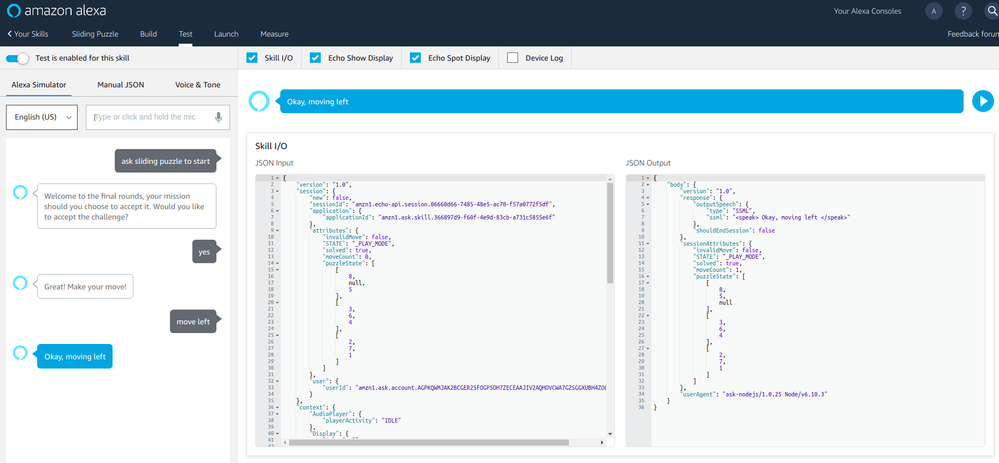

# Build Alexa Skill

There are many excellent resources on how to create custom Alexa Skill using `nodejs-sdk` and `ask-cli`, to avoid being repetitive, I will not go into details on each steps. Please refer to the following better documented tutorials:

- [Quick Start Alexa Skill Kit CLI](https://developer.amazon.com/docs/smapi/quick-start-alexa-skills-kit-command-line-interface.html#step-2-install-and-initialize-ask-cli)
  - **MUST READ**, unless you're all familiar with the development cycle.
  - `ask new` by default will gives a "HelloWorld" skill template, you could play around with this sample with ASK-CLI commands.
- [Alexa Skill Kit SDK for nodejs](https://github.com/alexa/alexa-skills-kit-sdk-for-nodejs/tree/v1.0.25)
  - If you want to strictly follow our Alexa Skill code base, **please install a legacy version 1 of the `ask-sdk` by `npm install --save ask-sdk@1.0.25`**.
  - Or **alternatively**, you could copy the entire [slidingPuzzle folder](./src/slidingPuzzle/), change directory to `slidingPuzzle/lambda/custom` and type `npm install` which will install all dependencies and packages specified in `package.json`

After installing and configuring, simply **copy everything under `slidingPuzzle/` folder, except `.ask/` folder but including `.gitignore`**. ( NOTE: after your first `ask new`, you should hit `ask deploy` which will automatically update your `.ask/config` with the correct `skill_id` field).

All Alexa Skill code should be pretty self-explanatory, if you bumped into any syntax or alien usage of `ask-sdk`, please submit an issue or usually you'll find documentation in:
- [ASK-SDK doc for nodejs 0.1.15](https://github.com/alexa/alexa-skills-kit-sdk-for-nodejs/tree/v1.0.25)
- [DynamoDB Examples](https://docs.aws.amazon.com/sdk-for-javascript/v2/developer-guide/dynamodb-examples.html)
- [skill state management ](https://github.com/alexa/alexa-skills-kit-sdk-for-nodejs/tree/v1.0.25#skill-state-management)

## Testing
- The best testing channel is [amazon alexa developer console](https://developer.amazon.com/alexa/console/ask), where you could see all details on your *Interaction Model*, typing in your command to test your skill should come handy and agile.

- Testing directly from terminal is also possible using [`ask simulate`](https://developer.amazon.com/docs/smapi/ask-cli-command-reference.html#simulate-command)

## Encountered Problems?
- Check your *IAM Role*, make sure at least you have `lambda_basic_execution_access`, `dynamodb_execution` permissions.

<a href="./0-system-architecture.md"></img></a>
<a href="./2-invoking-lambda-function.md"></img></a>
