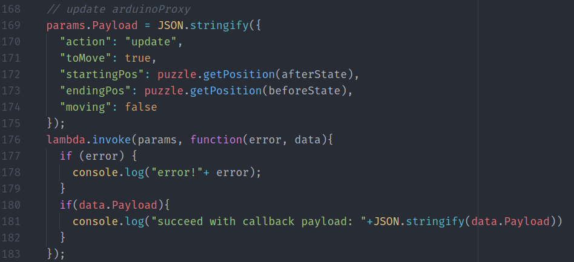

# Invoking Another Lambda Function

## Why
Since we separate Alexa Skill's Lambda function from our implementation of Web Server, when a new voice command was processed by the Alexa Lambda and the puzzle state was updated, the Web Server who's responding to the Arduino about the current state or the next move should be notified and updated as well.

To do this, we will need inter-invocation of two lambda functions which is as easy as a few lines of code shown below.

## How
By using `aws-sdk` nodejs package, here is a [great example from StackOverflow](https://stackoverflow.com/questions/31714788/can-an-aws-lambda-function-call-another?utm_medium=organic&utm_source=google_rich_qa&utm_campaign=google_rich_qa).

A concrete example in our code base is in [`slidingPuzzle/lambda/custom/stateHandlers.js`](https://github.com/AlexXiong97/alexa-skill-with-arduino-webclient/blob/master/src/slidingPuzzle/lambda/custom/stateHandlers.js#L168) where we update our "*Web Server*" with the latest puzzle state through invoking that lambda function whose `action` paramters is `update`, or namely `../prod/puzzle?action=update&toMove=true&startingPos=...`:

<a href="./3-configure-api-gateway.md"></img></a>
<a href="./5-configure-cloudfront.md"></img></a>
