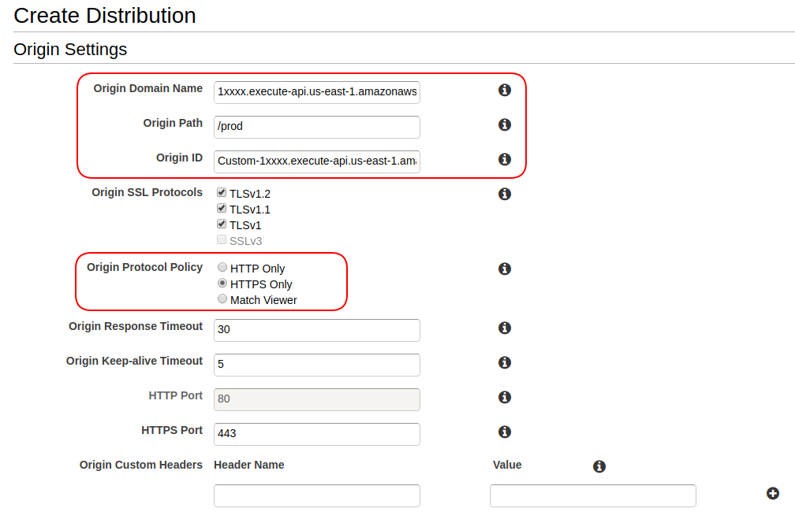
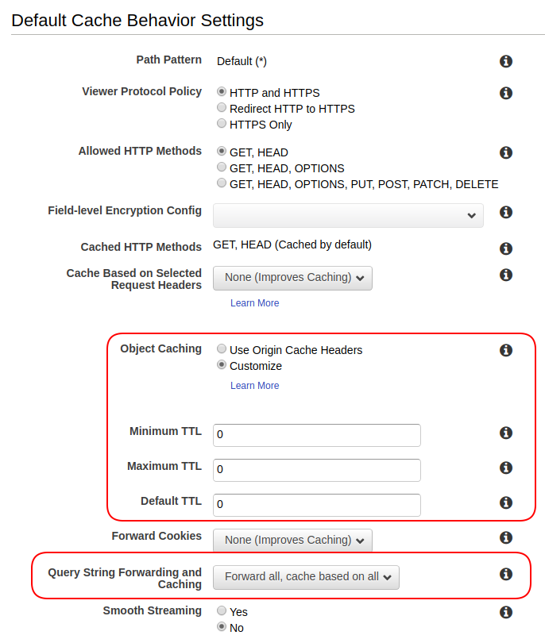
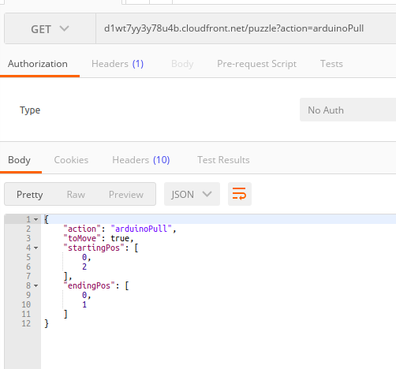

# Configure Amazon Cloud Front

## Why Using CloudFront
** *Amazon API Gateway* only accepts HTTPS, while Arduino could only send HTTP request.** Here is a [related StackOverflow Question](https://stackoverflow.com/questions/43236152/how-to-make-aws-api-gateway-accept-http-instead-of-https/49992626#49992626).

## How
- Go to [Amazon CloudFront](https://console.aws.amazon.com/cloudfront/home?region=us-east-1) and create a distribution.
- Most fields just leave them as default, the highlighted fields inside red rectangular in the following screenshots are ones needs configurations:
  - `1xxxx` is the placeholder for the unique identifier of your "Invoke URL" in your [API deployed](./3-configure-api-gateway)
  - **`Default TTL` should be set to 0**, time-to-live is used for Content Delivery Network (CDN) set up in Amazon CloudFront service: meaning usually your content, mostly for website assets like JavaScript, CSS files, will be cached when you first visit a certain URL. And the next time you visit the same URL, the CloudFront service will serve you directly with the cached/last version of the response, even if the response should have been different. Only after the TTL time outs, will the cached contents be updated. That's why under our real-time update requirement, a TTL of 0 is necessary.
  - **query string forwarding should be enabled**, so that when your Arduino visit cloudfront proxy URL with paramters in query string, the Web Server Lambda will still ultimately received them.
- The deployment takes quite some time, most likely ~ 10 minutes or so, because Amazon will update all of its DNS server to direct the traffic, once deployed you could go ahead to testing.

## Testing
Instead of calling Amazon API Gateway URL, call your cloudfont domain of the format: `d1xxxxx.cloudfront.net/puzzle?action=arduinoPull`, you should get something similar:

<a href="./4-invoking-another-lambda.md"></img></a>
<a href="./6-arduino-webclient.md"></img></a>
