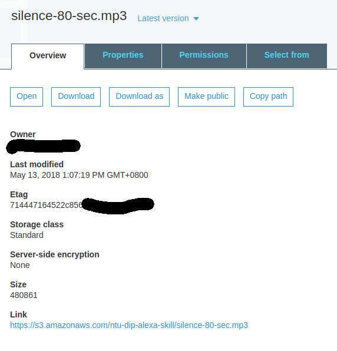

# Keep Alexa Waiting for Answer Without Ending Sessions <small> -- the hacky way</small>

## Background Story
To briefly recap, the original project was using Alexa to control a robotic arm to play a sliding puzzle. Now, the movement of robotic arm is painfully slow (6~15 seconds), plus the network delay and non-negligible execution time, the entire cycle takes roughly (10~22 seconds) in our case.

Now quoting from [this StackOverflow thread](https://stackoverflow.com/questions/38191837/how-to-keep-an-alexa-skill-open?utm_medium=organic&utm_source=google_rich_qa&utm_campaign=google_rich_qa):
>So totally intial 8 seconds until reprompt and 8 seconds again after reprompt. Total of 16 seconds.
>
>... You will have to remember the session and session variables go away after the session ends

This is far from desirable for our sliding puzzle application since losing the states of puzzle is as good as dysfunctional system. And, since there are **no built-in solution** for this, keeping Alexa awake falls in the [manifestation of hacky minds](https://stackoverflow.com/a/49226933/6578716).

## Solution
Use **silent audio streaming** to fill in the gap!! ( applaud for the guy who came up with this! )

**Each audio should be less than 90s**, with reprompt, it gives a window of slightly less than 180s, which should be more than enough for most applications!

```shell
sudo apt install ffmpeg
ffmpeg -f lavfi -i anullsrc=r=44100:cl=mono -t 80 -q:a 9 -acodec libmp3lame out.mp3
ffmpeg -y -i out.mp3 -ar 16000 -ab 48k -codec:a libmp3lame -ac 1  silence-80-sec.mp3
```

1. The command above generate a 80-second silent audio whose format was transformed into an acceptable format for Alexa.
2. Now, upload this silence-80-sec.mp3 to [Amazon S3 Bucket](https://s3.console.aws.amazon.com/s3/home), upon success, you should see a S3 link which should be copied
3. Imitate the following code in your Alexa Skill code.

```javascript
const silence = "<audio src='YOUR_S3_LINK'>";
...
this.response.shouldEndSession(false);
var reply = "blah blah blah";
this.emit(':ask', reply+silence, silence);
...
```


